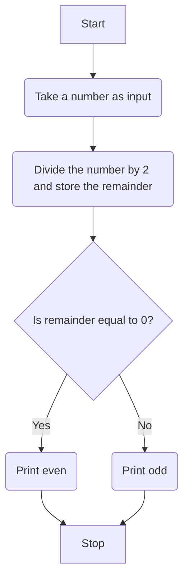

# Markdown preview mermaid support demo

Flowchart designed with Markdown Preview Mermaid Support VS Code extension.

## Problem statement

---

Visualize the flow to determine whether a number is even or odd.

## Flowchart

---

## References

---

Checkout my medium article where I go through the steps of creating the flowchart- 