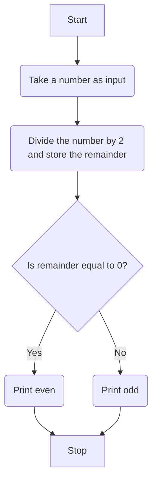

```mermaid
flowchart TD;
    Start --> IN(Take a number as input) --> R(Divide the number by 2 and store the remainder) --> REZ{Is remainder equal to 0?};
    REZ --> |Yes| PE(Print even) --> Stop;
    REZ --> |No| PO(Print odd) --> Stop;
```